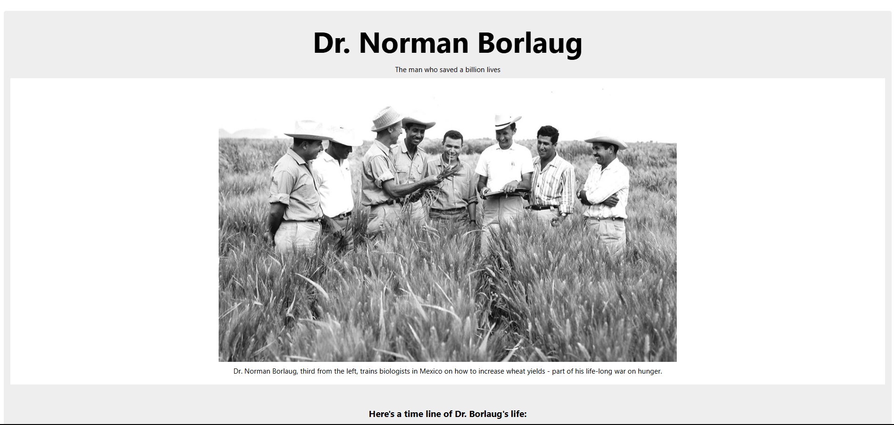

# 🌟 Tribute Page​

Welcome to the Tribute Page repository! This project consists of a simple and responsive tribute page, developed with HTML5 and CSS3. The goal is to honor a significant personality or entity, practicing the creation of accessible and visually pleasing web pages. 

## Layout

    

## 📋 Features

- **Tribute Page:** Presents information about the honored personality or entity, including images, descriptions and relevant links. 

- **Responsive Layout:** Adapts to different screen sizes, ensuring a good experience on mobile devices and desktops. 

- **Clean and Intuitive Design:** Uses a soft color palette and legible typography to facilitate reading and navigation. 

## 🛠️ Technologies Used

- **HTML5:** Semantic structuring of the page content. 

- **CSS3:** Responsive styling and layout of the page.